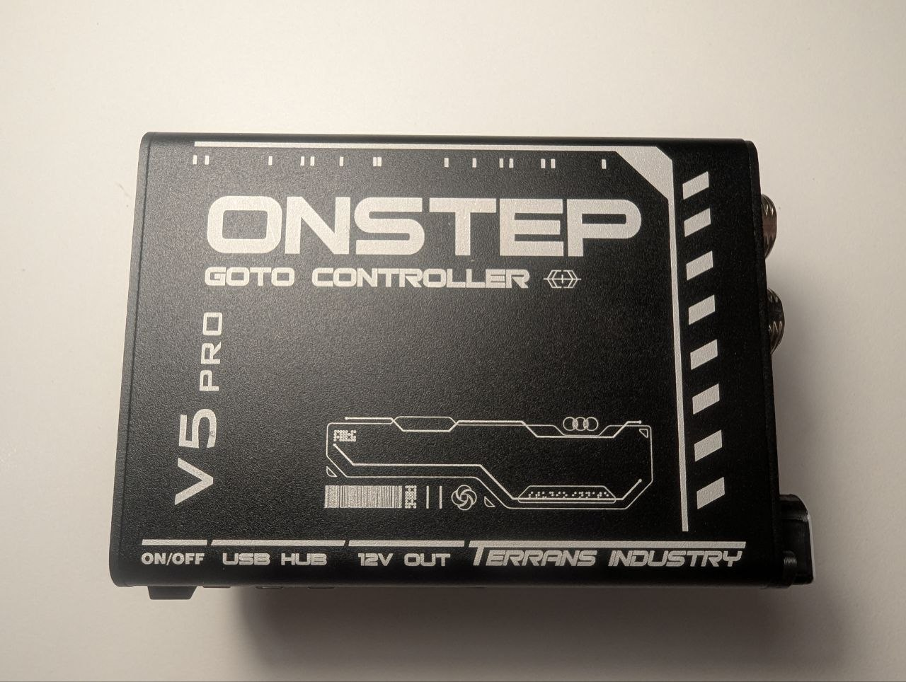
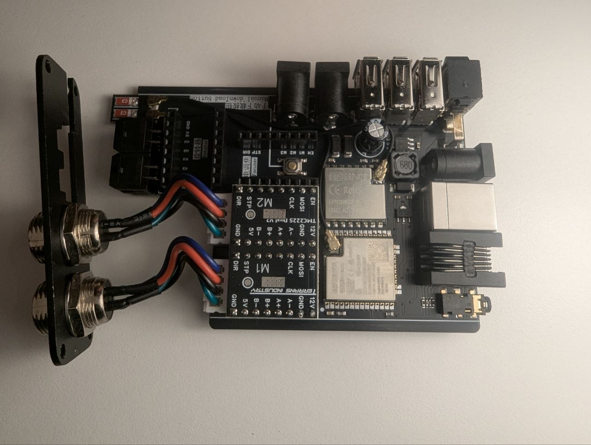
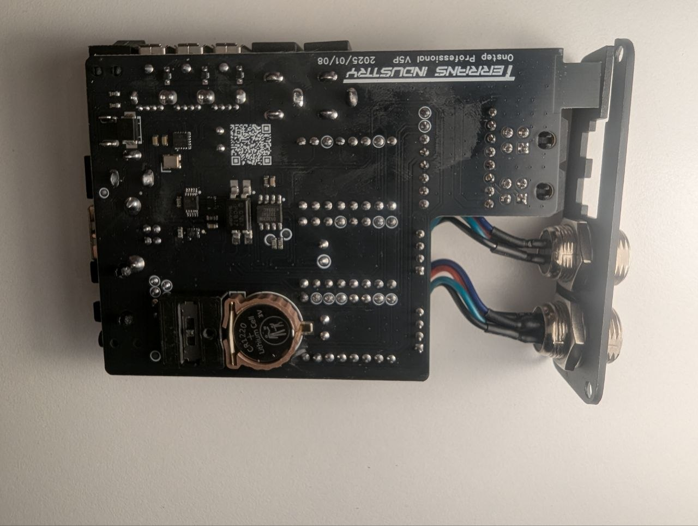
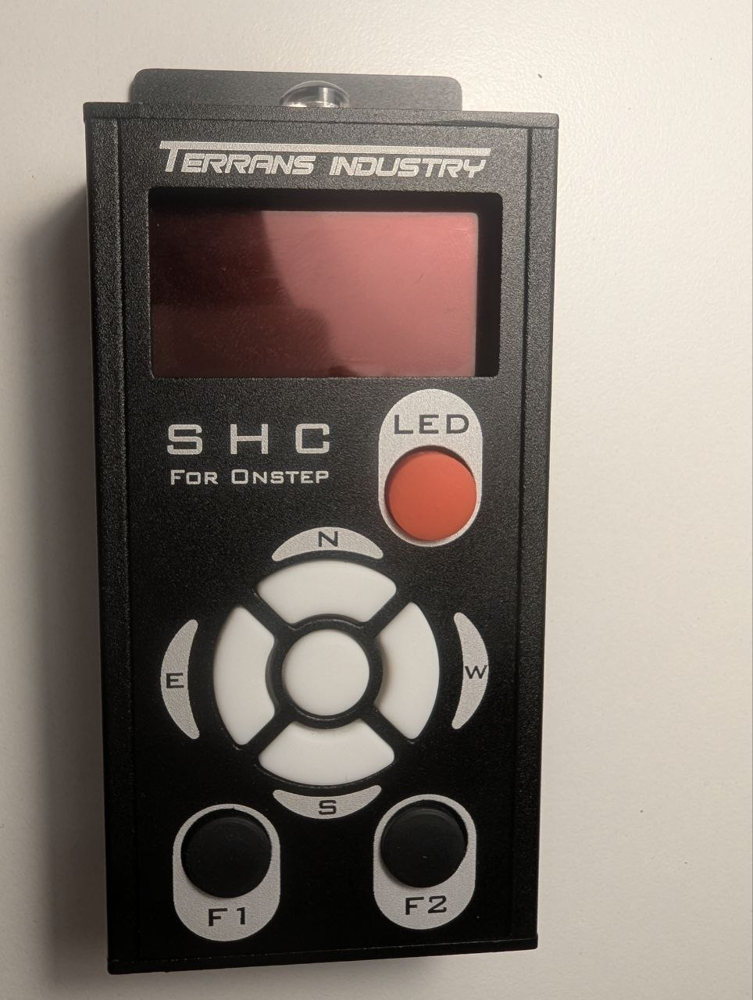
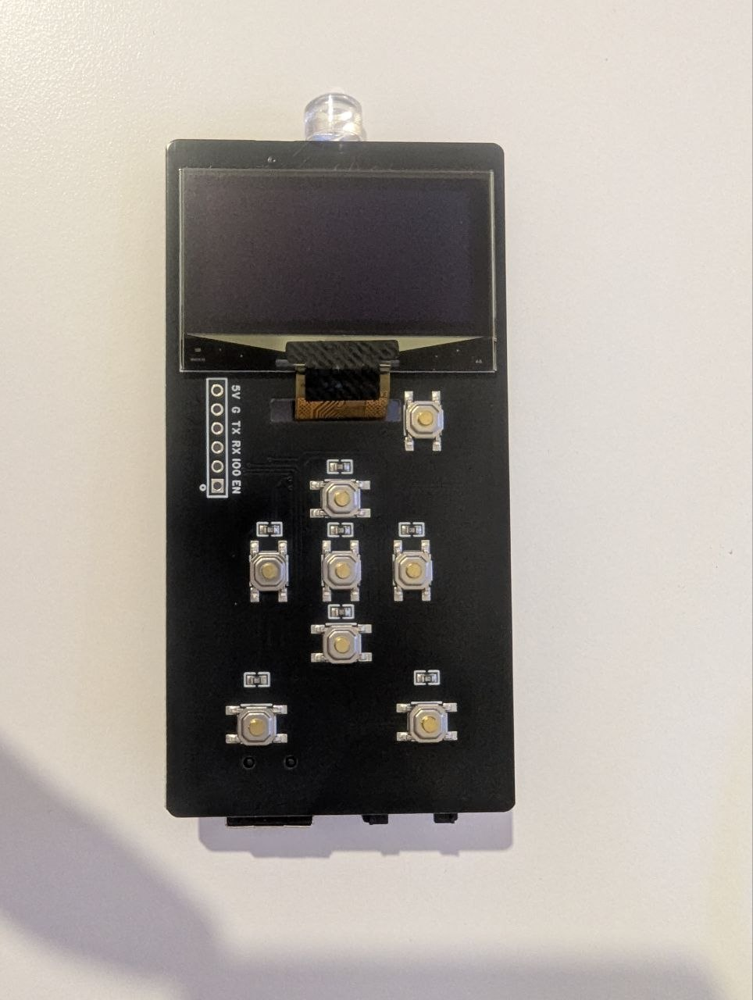
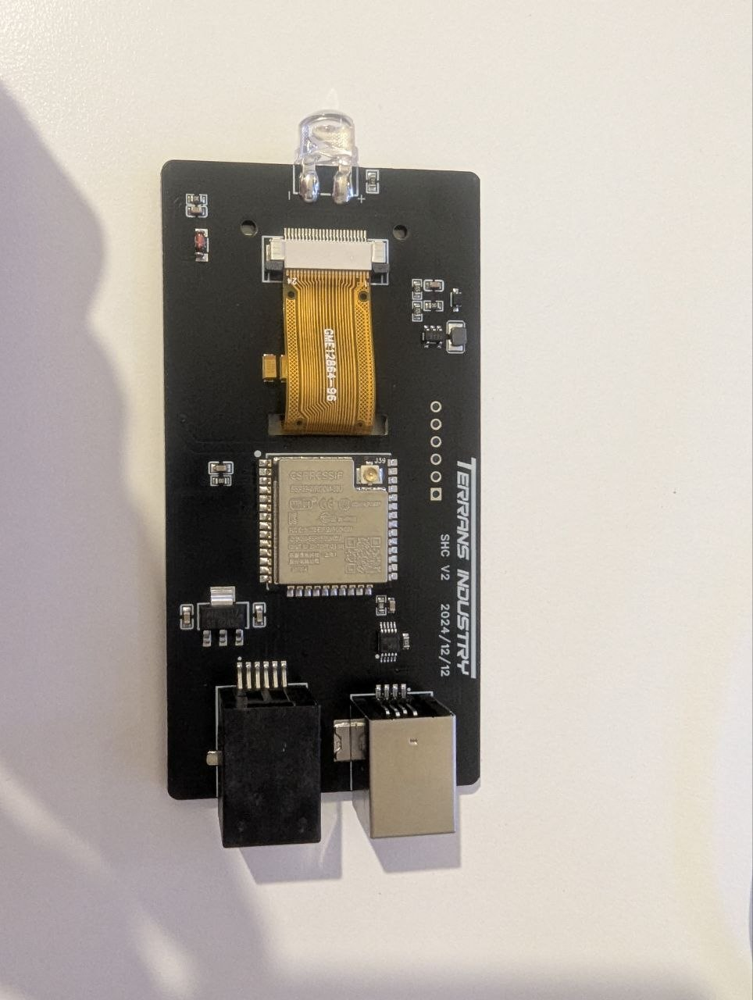

# Unofficial firmware update for Terrans Industry Onstep V5 Pro for EXOS2/CG5/EQ5 mount

## Changes against upstream

* Configuration for Terrans Industry Onstep V5 Pro for EXOS2/CG5/EQ5 mount
* Fix for [a time synchronisation issue with Stellarium Mobile Plus](https://onstep.groups.io/g/main/topic/100216132)

## How to flash

```bash
PORT=/dev/ttyUSB0

# Terrans Industry Onstep Goto Controller V5 Pro: primary OnStepX firmware
# Turn off, then set the switch to left position, turn on and connect USB Type-B cable
esptool --chip esp32 --port "${PORT}" \
        write-flash --erase-all \
        --flash-mode dio --flash-freq 80m --flash-size 4MB \
        0x1000 "./OnStepX/build/esp32.esp32.esp32/OnStepX.ino.bootloader.bin" \
        0x8000 "./OnStepX/build/esp32.esp32.esp32/OnStepX.ino.partitions.bin" \
        0xe000 "./OnStepX/build/esp32.esp32.esp32/boot_app0.bin" \
        0x10000 "./OnStepX/build/esp32.esp32.esp32/OnStepX.ino.bin"

# Terrans Industry Onstep Goto Controller V5 Pro: WiFi and web interface
# Turn off, then set the switch to right position, turn on and connect USB Type-B cable
esptool --chip esp8266 --port "${PORT}" \
        write-flash --erase-all \
        0x0 "./SmartWebServer/build/esp8266.esp8266.d1/SmartWebServer.ino.bin"

# Do not forget to set the switch back to center position!

# Terrans Industry Smart Hand Controller (SHC)
# Just connect USB Type-B cable to the SHC
esptool --chip esp32 --port "${PORT}" \
        write-flash --erase-all \
        --flash-mode dio --flash-freq 80m --flash-size 4MB \
        0x1000 "./SmartHandController/build/esp32.esp32.esp32/SmartHandController.ino.bootloader.bin" \
        0x8000 "./SmartHandController/build/esp32.esp32.esp32/SmartHandController.ino.partitions.bin" \
        0xe000 "./SmartHandController/build/esp32.esp32.esp32/boot_app0.bin" \
        0x10000 "./SmartHandController/build/esp32.esp32.esp32/SmartHandController.ino.bin"
```

## How to build

```bash
# Install prerequisites
sudo ./1-install-arduino-cli.sh
./2-install-esp-toolchains.sh
./3-install-arduino-libs.sh

# Terrans Industry Onstep Goto Controller V5 Pro: primary OnStepX firmware, tracking and Bluetooth
./4-build-onstepx.sh
# Terrans Industry Onstep Goto Controller V5 Pro: WiFi and web interface
./6-build-smartwebserver.sh

# Terrans Industry Smart Hand Controller (SHC)
./5-build-smarthandcontroller.sh

# List firmware files
ls -lh ./*/build/*/*.bin
```

## Photos for reference

| Device | Enclosure | PCB front | PCB back |
| --- | --- | --- | --- |
| OnStep GoTo controller |  |  |  |
| Smart Hand Controller |  |  |  |
